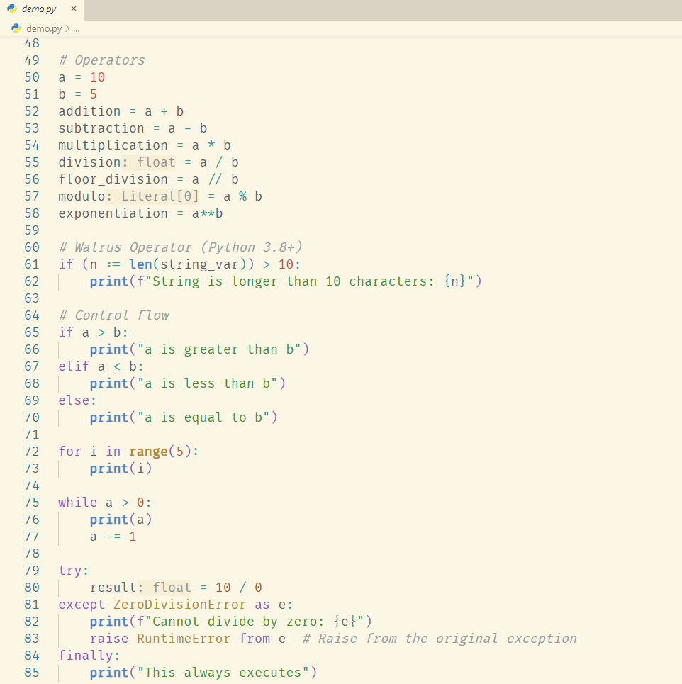

# VSCode Solarized Light Enhanced Theme

A enhanced solarized light theme for Visual Studio Code.

## Screenshot

## Inspired By

- [Solarized](https://github.com/altercation/solarized)
- [Better Solarized](https://github.com/edheltzel/vscode-better-solarized)
- [One Dark Pro](https://github.com/Binaryify/OneDark-Pro)
- [Atom One Light Theme](https://github.com/akamud/vscode-theme-onelight)
